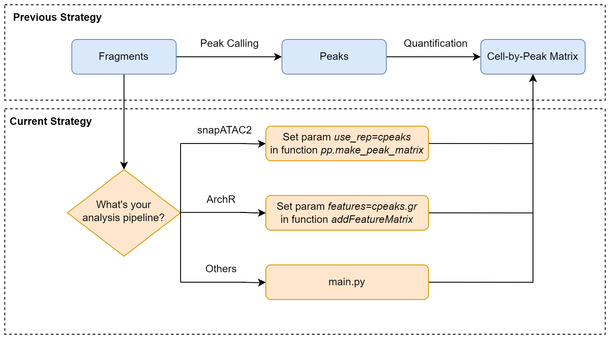

## cPeaks: A Generic Chromatin Accessibility Reference for scATAC-seq Data Analysis

### Introduction
cPeaks is a comprehensive chromatin accessibility reference designed to improve scATAC-seq data analysis by providing a standardized set of features. Unlike traditional peak-calling methods that require dataset-specific processing, cPeaks enables direct feature extraction, improving **cell annotation, rare cell type detection, and cross-dataset consistency**.

**Key Features:**
- **Generic Reference**: Built from 624 high-quality bulk ATAC-seq datasets, covering diverse human tissues and cell types.
- **Expanded with Deep Learning**: Incorporates 280,000 predicted peaks to improve accessibility coverage for unseen cell types.
- **Superior Performance**: Enhances cell annotation accuracy and rare cell type detection compared to existing feature sets.
- **Multi-platform Support**: Compatible with SnapATAC2, ArchR, and standalone Python workflows.

For a detailed description, see our publication: [Meng Q, Wu X, et al. *bioRxiv* 2024](https://doi.org/10.1101/2023.05.30.542889).

---

### Download
We provide cPeaks in **.bed format** for two genome versions:
- [GRCh37/hg19](https://cloud.tsinghua.edu.cn/f/7b7664158dd7482c9a95/?dl=1)
- [GRCh38/hg38](https://cloud.tsinghua.edu.cn/f/ff4591857f5d472d9401/?dl=1)

Basic information about cPeaks can be found in **[cPeaks_info.tsv](https://cloud.tsinghua.edu.cn/f/4422592d373948589dc4/)**.

---

### Quick Start Guide
cPeaks eliminates the need for peak calling, allowing direct feature mapping. Below are examples for SnapATAC2, ArchR, and standalone Python scripts.



#### **SnapATAC2 (Python)**
```python
# Load cPeaks file (hg19 or hg38)
cpeaks_path = 'YOUR_PATH/cpeaks_hg38.bed'
with open(cpeaks_path) as cpeaks_file:
    cpeaks = [f'{line.split()[0]}:{line.split()[1]}-{line.split()[2]}' for line in cpeaks_file]
# Use cPeaks as the reference
import snapatac2 as snap
adata = snap.pp.make_peak_matrix(adata, use_rep=cpeaks)
```

#### **ArchR (R)**
```r
# Load cPeaks file (hg19 or hg38)
cpeaks <- read.table('YOUR_PATH/cpeaks_hg19.bed', col.names = F)
cpeaks.gr <- GRanges(seqnames = cpeaks$V1, ranges = IRanges(cpeaks$V2, cpeaks$V3))
# Use cPeaks in ArchR
proj <- addFeatureMatrix(proj, features = cpeaks.gr, matrixName = 'FeatureMatrix')
```

#### **Standalone Python Script**
```bash
git clone https://github.com/MengQiuchen/cPeaks.git
cd cPeaks/map2cpeak
python main.py --fragment_path PATH/to/YOUR_fragment.tsv.gz --output map2cpeaks_result
```
Output files will be stored in `map2cpeaks_result/`, including:
- `cell_cpeaks.mtx` (feature matrix)
- `barcodes.txt` (cell IDs)

[Learn more about arguments](https://mengqiuchen.github.io/cPeaks/Tutorials/#/?id=arguments).

---

### Comprehensive Guide
For advanced usage, including **integration with custom workflows, tuning parameters, and best practices**, see our **[detailed tutorials](https://mengqiuchen.github.io/cPeaks/Tutorials/#/?id=_3-comprehensive-guide)**.

---

### Citation
Please cite our work if you use cPeaks in your research:
**Meng Q, Wu X, et al.** A generic reference defined by consensus peaks for scATAC-seq data analysis. *bioRxiv* (2024). [DOI: 10.1101/2023.05.30.542889](https://doi.org/10.1101/2023.05.30.542889)

---

### Contact
If you encounter any issues or have recommendations, please contact:
**Meng Qiuchen** at [qiuchenmeng@outlook.com](mailto:qiuchenmeng@outlook.com).

